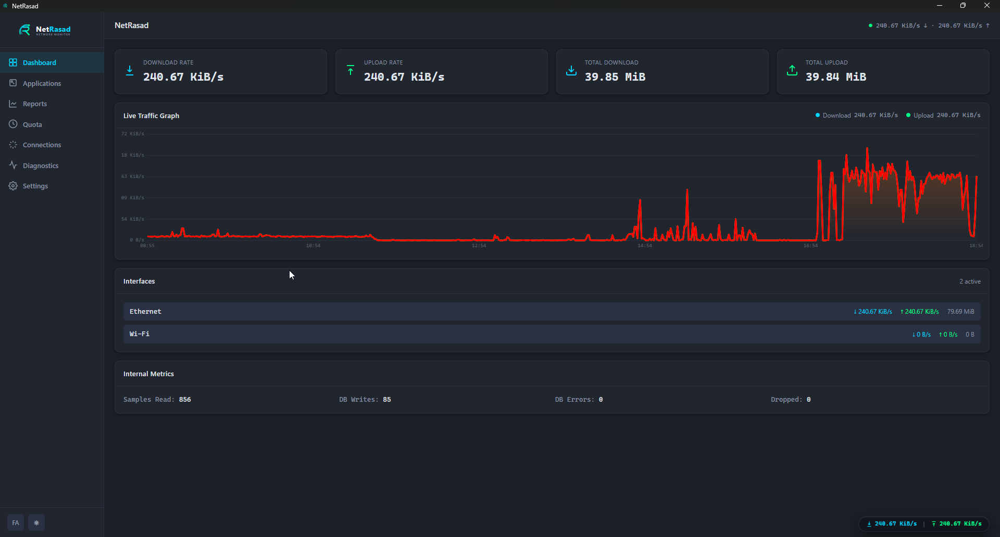
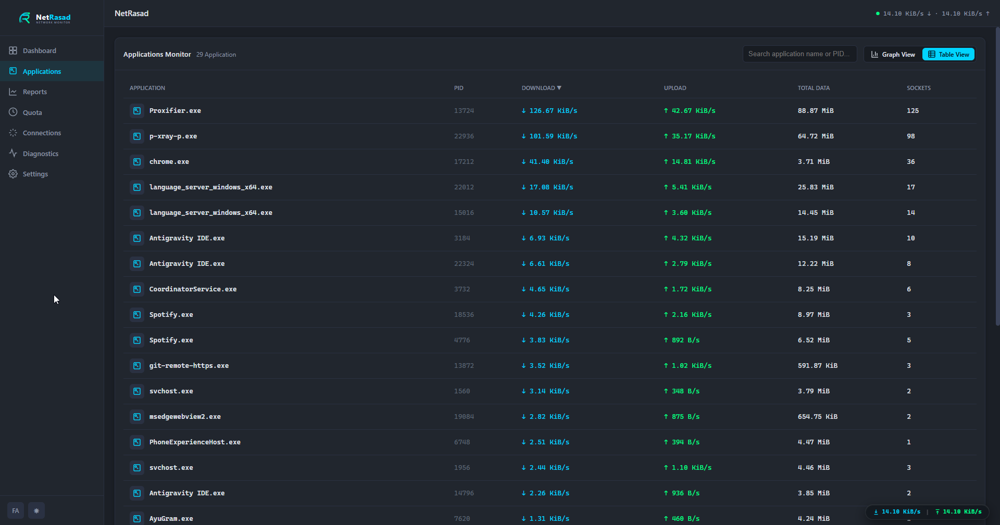
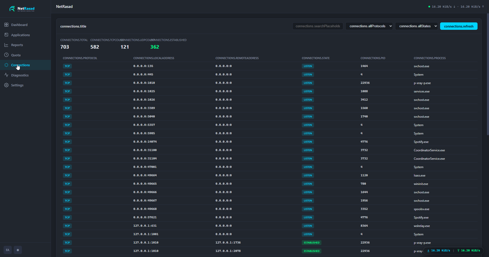
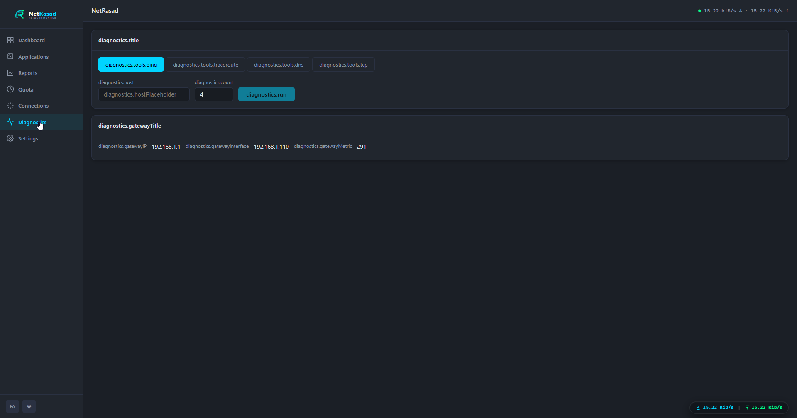
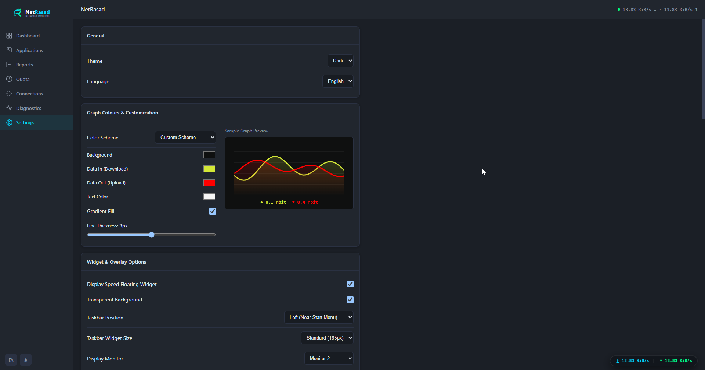
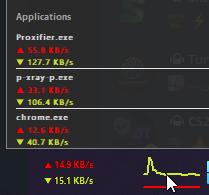
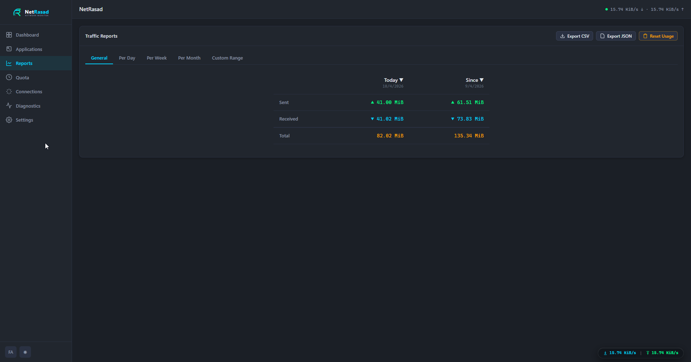
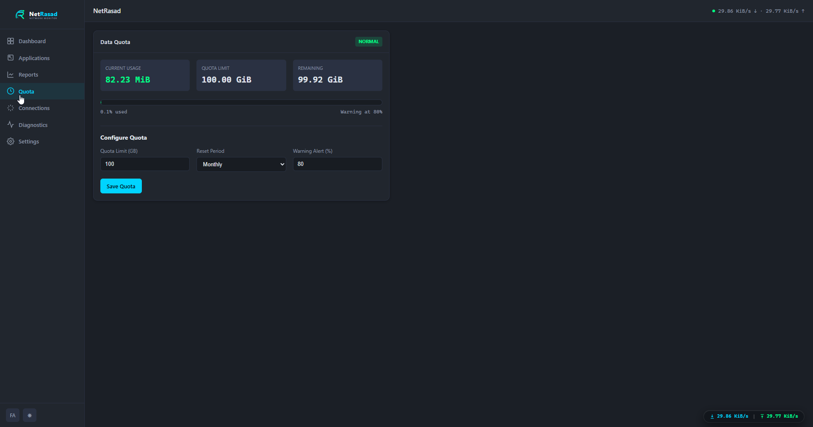

# 🌐 NetRasad (نت‌رصد)

<div align="center">
  
  
  
  
  
  
</div>

<br />

> **NetRasad** is an advanced, cross-platform desktop application designed for real-time network traffic monitoring and deep packet diagnostics. Built on top of the highly performant **Wails v2** framework (Go backend + Vue 3 frontend), it seamlessly provides live speed graphs, advanced diagnostic tools, per-app connection viewers, and an intuitive UI. 

---

## 🚀 Key Features

* **⚡ Real-Time Traffic Monitoring**: Track your network download and upload speeds with a beautiful, dynamic live graph.
* **🖥️ Taskbar & System Tray Overlay**: Keep an eye on your network throughput without maximizing the app. Includes support for multi-monitor taskbar displays.
* **🔍 Per-Application Monitoring**: View exact data usage and active network connections grouped by individual processes.
* **🛠️ Advanced Network Diagnostics**:
  * **Ping**, **Traceroute**, **DNS Lookup**, **TCP Connect**
  * Gateway and Interface detection (with SSID integration).
* **🌍 Full i18n Support**: Native RTL (Persian) and LTR (English) localization.
* **💾 Persistent Storage & Quotas**: All historical data is safely stored locally via SQLite, providing accurate Data Quota tracking across reboots.
* **📡 Modem/Router Integration**: Direct Telnet integration to view ADSL stats, WiFi configurations (SSID and ghosts), active DNS, Firewall/NAT rules, and Reboot capability.
* **🎨 Modern UI/UX**: Fully customizable dark-themed UI, flexible color schemes, draggable Ping widget, and seamless native-like experience.

---

## 📸 Screenshots

Here is a glimpse of NetRasad in action:

<details>
<summary><b>Click to Expand Screenshots Gallery</b></summary>

| Dashboard | Applications Monitor |
| :---: | :---: |
|  |  |

| Connections | Network Diagnostics |
| :---: | :---: |
|  |  |

| Settings & Customization | Tooltip & Widget Preview |
| :---: | :---: |
|  |  |

*Additional previews:*
<br>
**Traffic Reports:**<br>

<br>
**Data Quota & Others:**<br>



</details>

---

## ⚙️ Tech Stack

| Layer | Technology |
| :--- | :--- |
| **Backend Core** | Go 1.26, Wails v2 |
| **Frontend UI** | Vue 3, TypeScript, Vite, Pinia, Vue-Router, Vue-i18n |
| **Data Storage** | SQLite |
| **Platform APIs** | Windows IP Helper (`GetIfTable2`), `wlanapi.dll` |

---

## 🗺️ Roadmap & TODOs

- [x] Multi-monitor taskbar overlay support.
- [x] Localization (English/Persian).
- [x] **Modem Settings Integration** - Add configuration pages and features specifically for managing and viewing Modem/Router statistics directly from NetRasad.
- [x] Floating Ping Widget with persistent dragging support.

---

## 🛠️ Build & Installation

### Prerequisites
* **Go** 1.21+ (1.26 recommended)
* **Node.js** 18+
* **Wails CLI** v2

### Setup
Install Wails CLI:
```bash
go install github.com/wailsapp/wails/v2/cmd/wails@latest
```

### Development Mode
To run the app with live reload for both backend and frontend:
```bash
wails dev
```

### Production Build
To compile the final standalone executable:
```bash
wails build -clean -platform windows/amd64
```

Alternatively, use the custom PowerShell build script to inject version tags (e.g. for GitHub releases):
```powershell
.\scripts\build.ps1 -Version v1.0.2
```
The output binary will be located at: `build/bin/NetRasad.exe`

---

## 📄 License
This project is licensed under the [MIT License](LICENSE).
